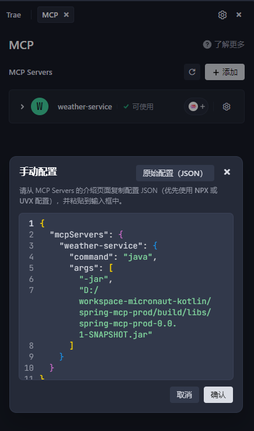

# spring-mcp-prod


# mcp-config.json 配置到tare的自定义mcp配置
```json
{
  "mcpServers": {
    "weather-service": {
      "command": "java",
      "args": [
        "-jar",
        "D:/workspace-micronaut-kotlin/spring-mcp-prod/build/libs/spring-mcp-prod-0.0.1-SNAPSHOT.jar"
      ]
    }
  }
}
```

tare如图配置：



疑问：
1. 要加载这个插件，本地用户必须安装java环境
2. 能不能有远程运行的mcp
3. 怎么做支付
4. 怎么做auth认证系统 基于证书模式